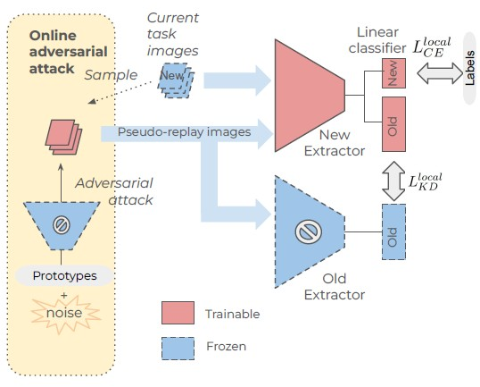

# Adversarial Pseudo-replay for Exemplar-free Class-incremental Learning

The official implementation of our paper "Adversarial Pseudo-replay for Exemplar-free Class-incremental Learning" (WACV 2026), by Hiroto Honda.
[[arXiv](https://www.arxiv.org/abs/2511.17973)]

## What's New

- Code is released! (Jan. 5, 2026)
- APR has been accepted to WACV2026 ! (Nov, 2025)

## Method

<p align="left"> </p>

The images from the new task are transformed into old-task data via adversarial attack in an
online manner. Local (logits-based) knowledge distillation using the pseudo-replay images and preserved (old) network prevents the new extractor from semantic drift.


## Performance

Incremental accuracy benchmark in *T=10* cold-start setting.
Please see our paper for other results.

Method | Classifier |  CIFAR100  |  Tiny<br>ImageNet | ImageNet-<br>subset
--- | --- | --- | --- | ---
Joint (*) |  Linear  | 84.18  |  70.54  |  87.48
LwF |  NCM |  60.48  |  44.07 |  67.83
FeCAM |  Mahalanobis   | 52.61 |   46.01  |  61.02
SDC  |  NCM  |  63.68  | 51.12  | 71.16
ADC  |  NCM  | 66.24  | 53.75 |  69.98
AdaGauss |  Mahalanobis  |  66.66 |   53.53  |  67.96
**APR**  |  Linear   | 67.20  |  54.70  |  70.93
**APR**  |  NCM  | *69.00* |  *55.58*  |  *73.00*
**APR**  |  Mahalanobis  | **69.96** |  **56.39**  |   **73.86**

(* "Joint" is the upper-bound setting, where all the old data are available in all tasks.)

## Docker

Install `docker-compose` and `nvidia-container-runtime` beforehand.

```bash
$ docker compose build --build-arg UID="`id -u`" dev
$ docker compose run dev
```

## Dataset

Please prepare the dataset under `/work/data/` folder.
```
/work/data/cifar-100-python/
/work/data/tiny-imagenet-200/
/work/data/imagenetsub/
```

Note that CIFAR100 starts downloading automatically.

## Training

```bash
python tools/train.py configs/cifar100/apr.yaml

usage: train.py [-h] [--cfg-options [CFG_OPTIONS ...]] [--ckpt CKPT] [--seed SEED] [--clsseed CLSSEED] [--device DEVICE] [--logfile LOGFILE] [--resultcsv RESULTCSV] config

positional arguments:
  config  default: "config/cifar100/apr.yaml"

options:
  -h, --help            show this help message and exit
  --cfg-options [CFG_OPTIONS ...]
                        Dot-dict style overrides(e.g. model.layers=101 model.use_bn=True)
  --ckpt CKPT
  --seed SEED  default: 0
  --clsseed CLSSEED  default: 1993
  --device DEVICE  default: "cuda"
  --logfile LOGFILE  default: log.log
  --resultcsv RESULTCSV  default: experiment_results.csv
```

You can use `--resultcsv` to specify a csv file to record experiment settings and results - incl. config and arg settings, git hash, git diff, all metrics results and elapsed time. The csv file can be used for another experiment to append its settings and results, if the existing file path is specified.

### Config

We use `OmegaConf` package. The config file such as `configs/cifar100/apr.yaml` should be specified when running `train.py`, and it overrides the base config `configs/default.yaml`.

Also, you can override any config values with `--cfg-options`.

```bash
python tools/train.py configs/cifar100/apr.yaml --cfg-options incremental.init_cls=50 incremental.increment=10 init_optimizer.type=adam
```

Please check [[config docs](docs/CONFIGS.md)] that describes usage of config parameters.

## Citation

Preprint version. We will update this with the camera-ready version after WACV26.

```BibTeX
@misc{honda2025adversarialpseudoreplayexemplarfreeclassincremental,
      title={Adversarial Pseudo-replay for Exemplar-free Class-incremental Learning},
      author={Hiroto Honda},
      year={2025},
      eprint={2511.17973},
      archivePrefix={arXiv},
      primaryClass={cs.CV},
      url={https://arxiv.org/abs/2511.17973},
}
```

## References

* [LAMDA-CL/PyCIL](https://github.com/LAMDA-CL/PyCIL)
* [ADC](https://github.com/dipamgoswami/ADC)
* [FeCAM](https://github.com/dipamgoswami/FeCAM)
